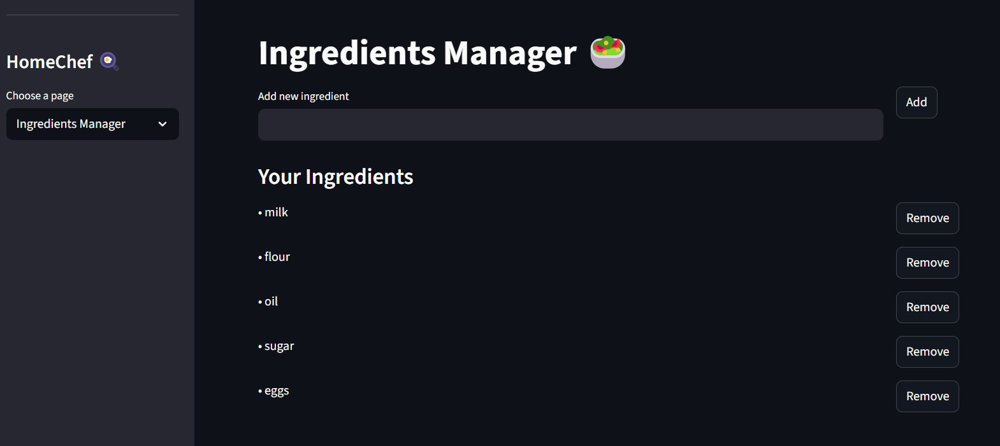

# HomeChef 🍳

HomeChef is a Streamlit-based application designed to assist users in managing their recipes, grocery lists, and ingredients. It also provides a recipe assistant for generating recipes and cooking tips.

## Features

- **Ingredients Manager**: Add, view, and manage your ingredients.
- **Recipe Assistant**: Generate recipes based on available ingredients and get cooking tips.
- **Grocery List Generator**: Create a grocery list from a recipe.
- **Favorites**: Save and manage your favorite recipes.

## Installation

1. Clone the repository:
   ```bash
   git clone https://github.com/your-repo/homechef.git
   cd homechef
   ```

2. Create and activate a virtual environment:
   ```bash
   python -m venv .venv
   .\.venv\Scripts\activate  # On Windows
   source .venv/bin/activate   # On macOS/Linux
   ~/homechef-venv/Scripts/Activate.ps1
   ```

3. Install the required dependencies:
   ```bash
   pip install -r requirements.txt
   ```

## Usage

1. Run the Streamlit app:
   ```bash
   streamlit run frontend/app.py
   ```

2. Open your browser and navigate to:
   - Local URL: `http://localhost:8501`
   - Network URL: `http://<your-network-ip>:8501`

## Screenshots

### Home Screen


### Ingredients Manager


### Recipe Assistant


### Recipe Assistant Demo


## Project Structure

```
homechef-project/
│
├── frontend/
│   ├── app.py                # Main Streamlit app
│   ├── api_client.py         # API client for backend communication
│   ├── config.py             # Configuration file for API endpoints
│   ├── data/                 # Data files (e.g., ingredients, favorites)
│   ├── pages/                # Streamlit pages
│   │   ├── favorites_page.py
│   │   ├── grocery_list_page.py
│   │   ├── ingredients_page.py
│   │   ├── recipe_assistant_page.py
│   │   └── recipe_page.py
│
├── requirements.txt          # Python dependencies
├── README.md                 # Project documentation
└── ...
```

## Requirements

- Python 3.8+
- Streamlit
- FastAPI
- LangChain
- Other dependencies listed in `requirements.txt`

## Contributing

Contributions are welcome! Feel free to open issues or submit pull requests.

## License

This project is licensed under the MIT License. See the `LICENSE` file for details.

---

Happy cooking with HomeChef! 🍳
